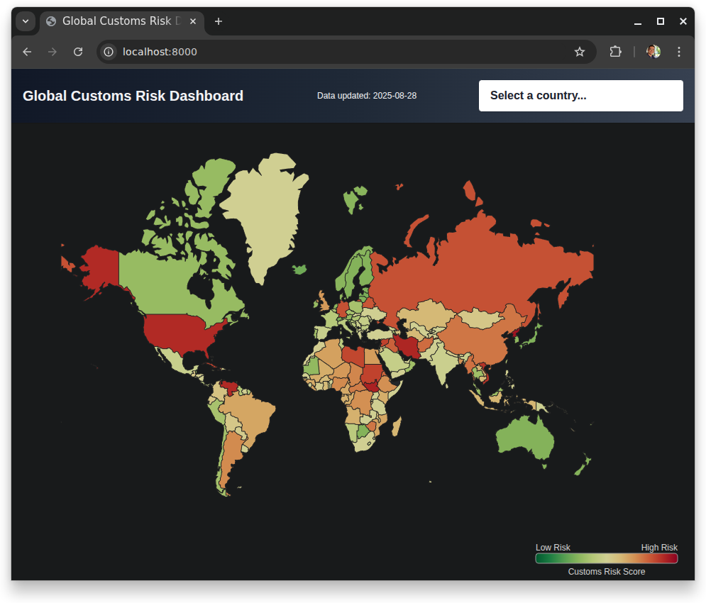

# Global Customs Risk Dashboard
Visualize and explore customs risk scores and issues for countries worldwide.



## Features
- Interactive world map colored by customs risk
- Click a country to view risk score and key issues
- Responsive, modern UI (React, D3, Tailwind CSS)

## Quick Start

1. **Clone this repository**
2. **Start a local server:**
   
	```sh
	python3 -m http.server
	```
3. Open your browser and go to [http://localhost:8000](http://localhost:8000)

## Data
- Country risk data: [`data/risk-data.json`](data/risk-data.json)
- Map data: [world-atlas TopoJSON](https://github.com/topojson/world-atlas)

## Tech Stack
- React (via CDN)
- D3.js & TopoJSON
- Tailwind CSS

## Customization
- To update risk data, edit `data/risk-data.json`.
- To change styles, edit `assets/styles.css`.

## Credits
- World map: [world-atlas](https://github.com/topojson/world-atlas)
- UI: [Tailwind CSS](https://tailwindcss.com/)
